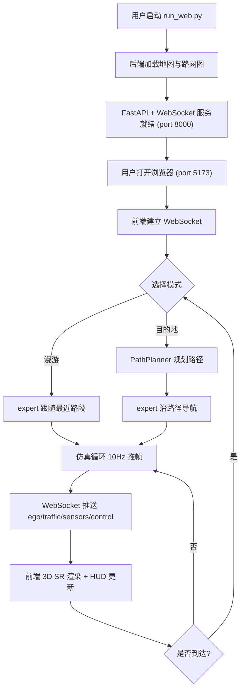

# AuroraDrive 极光智行 — 产品需求文档（PRD）

> ⚠️ 本文档为 Python Sidecar 路线产品需求，已被 Route B 纯 C++ 迁移取代。实际架构见 REFACTOR_CHANGELOG.md 阶段7 Route B 说明。

> 本文档为自动驾驶仿真系统的产品级可视化 HMI 设计规范，对标小鹏 XNGP / 华为 ADS 3.0 / 蔚来 NOP+ 的智驾座舱观感，作为仿真观测与能力展示的前端。

---

## 1. 产品概述

AuroraDrive 极光智行是为本自动驾驶仿真系统（M9 模型 + 闽清路网 + IDM/MOBIL 交通流）打造的**产品级 Web HMI**，替代原有 pygame 调试级可视化。系统通过 WebSocket 实时接收仿真后端的 ego 状态、感知结果、交通流、路径规划与控制信号，以 3D Surround Reality（SR）视图呈现驾驶场景，并提供路径规划与传感器调试面板。

- **主要目的**：把仿真循环从"能跑能看"提升到"产品级观感"，既服务于开发调试（看清模型决策、交通交互、传感器原始数据），又服务于能力演示（向非开发者展示系统可用性）。
- **解决的问题**：原 `fsd_visualizer.py` 是 2D 俯视 + 色块 + 矩形车，观感是"调试可视化"级别；缺乏车道级渲染、SR 透视、现代 HMI 数据条；且名称涉及 Tesla FSD 商标风险。
- **目标用户**：① 仿真开发者（日常调试模型行为、交通流、控制信号）；② 演示观众（评审、对外展示、招生宣讲）。
- **市场价值**：可作为整套自动驾驶系统的"门面"，决定第一印象；同时是后续车道级导航、SR 感知可视化的承载平台。

---

## 2. 核心功能

### 2.1 用户角色

| 角色 | 接入方式 | 核心权限 |
|------|---------|---------|
| 开发者 | 本地 `python run_web.py` 启动后端，浏览器访问 `localhost:5173` | 全部视图 + 模式切换 + 目的地规划 + 调试面板 |
| 演示观众 | 同上（旁观） | 全部视图（只读），模式切换由开发者操作 |

### 2.2 功能模块

3 个核心页面（每页功能密度高，避免分散）：

1. **驾驶舱（SR 主视图）** `/?view=cockpit`：3D 透视场景 + HUD 数据条 + 模式切换 + 决策提示
2. **导航台（路径规划）** `/?view=navigator`：2D 俯视地图 + 目的地搜索 + 路径预览 + 路点信息
3. **感知调试** `/?view=debug`：10 路相机网格 + 2 路 LiDAR 点云 + 控制信号曲线 + 模型输出

### 2.3 页面详情

#### 页面一：驾驶舱（SR 主视图）

| 模块名 | 功能描述 |
|--------|---------|
| 3D SR 场景 | 透视相机跟随 ego 车，渲染前方 150m / 后方 50m / 左右各 60m 内的道路、车道线、建筑、交通车；ego 车居中略前，相机俯角 ~25° |
| 车道渲染 | 基于 `lane_count` + `left_boundary` + `right_boundary` 生成车道线；当前所在车道高亮（极光青绿半透明带）；相邻车道暗化 |
| 路径引导 | 沿规划路径渲染悬浮箭头序列（极光粉发光），下一个 maneuver（变道/转弯）放大高亮 |
| 交通车 | 3D 车辆模型（按 vehicle_type：car/suv/truck/bus/motorcycle 五种轮廓），朝向跟随 heading，颜色按相对位置区分（前方=青、侧方=紫、后方=灰） |
| 建筑物 | 棱柱体拉伸（基于 vertices + height），夜景材质带 emissive 边缘光 |
| HUD 数据条 | 顶部：当前速度（大号 Sora 字体）+ 限速（圆形红框）+ NOA 状态徽章（启用/待机/接管）；底部：模式（漫游/目的地）+ 目的地名称 + 剩余距离 + ETA |
| 决策提示 | 右下角浮窗：当前 steer/throttle/brake 数值条 + 决策原因（跟车/巡航/制动/换道预备） |
| 模式切换 | 右上角玻璃态按钮组：漫游 ⇄ 目的地 |

#### 页面二：导航台（路径规划）

| 模块名 | 功能描述 |
|--------|---------|
| 2D 俯视地图 | 全屏 Canvas，渲染全路网（道路按 road_type 着色：高速=青、国道=紫、省道=蓝、县道以下=灰）；ego 位置实时更新带朝向箭头 |
| 目的地搜索 | 左侧浮层搜索框，输入名称模糊匹配（闽清地区站点/路口名），下拉候选列表 |
| 路径预览 | 选中目的地后，规划路径以极光粉发光折线渲染，起点/终点带脉冲圆环 |
| 路点列表 | 右侧面板列出关键路点（编号 + 坐标 + 累计里程），可点击聚焦 |
| 行程信息 | 顶部条：总里程 + 预计时长（按当前速度）+ 已完成百分比 |
| 漫游轨迹 | 漫游模式下显示历史轨迹（衰减尾迹，极光青绿渐隐） |

#### 页面三：感知调试

| 模块名 | 功能描述 |
|--------|---------|
| 10 路相机网格 | 5×2 网格，每路 224×224 相机帧实时刷新（Canvas 纹理流）；标注方位角（0°/36°/.../324°）；前向（0°）可放大单视图 |
| LiDAR 点云 | 3D 视图显示 2 路 LiDAR 点云（前/后），点按距离着色（近=青、远=紫），可旋转视角 |
| 控制信号曲线 | 实时滚动曲线：steer（-1~1）、throttle（0~1）、brake（0~1）、speed（0~200 km/h），时间窗口 30s |
| 模型输出 | 显示 M9 模型推理输出（steer/throttle/brake 预测值）与专家标签对比（误差条） |
| 系统状态 | 后端连接状态（WebSocket 在线/离线）、FPS、仿真步数、交通车数量、C++ 后端是否启用 |

---

## 3. 核心流程

### 3.1 启动流程

用户执行 `python run_web.py` → 后端加载地图（fujian_map.bin）+ 构建路网图（PathPlanner）+ 初始化 SensorSuite → 启动 FastAPI 服务（端口 8000）→ 用户打开浏览器访问 `localhost:5173`（Vite dev）或打包后的静态资源 → 前端建立 WebSocket 连接 → 后端开始推送仿真帧。

### 3.2 漫游模式数据流

```
后端仿真循环（10Hz）
  → expert_controller.control(ego_state, nearby_roads) 计算 steer/throttle/brake
  → bicycle_model 推进 ego 位置
  → SensorSuite 渲染 10 路相机 + 2 路 LiDAR
  → TrafficManager.update(ego_pos, heading, speed) 更新交通车
  → WebSocket 推送帧（ego_state + traffic + sensors + control）
前端接收
  → 驾驶舱 3D 场景更新（R3F 增量渲染）
  → HUD 数据条更新
  → 调试视图相机网格 + 点云 + 曲线更新
```

### 3.3 目的地模式数据流

```
用户在导航台选择目的地
  → 前端 POST /api/route {start_xy, end_xy}
  → 后端 PathPlanner.plan() 返回 UTM 路径点序列
  → 前端切换到驾驶舱，路径以箭头序列渲染
  → 仿真循环沿路径导航（expert 跟随 route_waypoints）
  → 到达检测（距离 < 30m）→ 自动切回漫游模式
```

### 3.4 流程图



---

## 4. 用户界面设计

### 4.1 设计风格

**主题：极光（Aurora）夜空** — 呼应产品名 AuroraDrive，把车载 HMI 的精确感与北极极光的流动感结合。

- **主色调**：
  - 背景 `#0A0E1A`（深夜空蓝黑）
  - 主色 `#00F5D4`（极光青绿）— 用于当前车道、ego 标识、激活态
  - 次色 `#9B5DE5`（极光紫）— 用于路径线、二级元素、相邻车
  - 强调 `#F15BB5`（极光粉）— 用于引导箭头、maneuver 提示
  - 警告 `#FEE440`（极光黄）— 用于限速、接管警告
  - 文字 `#E0E7FF`（主）/ `#94A3B8`（次）
- **按钮风格**：玻璃态（backdrop-blur + 半透明白边 + 微发光），圆角 12px，悬停时光晕扩散
- **字体**：
  - Display：**Sora**（几何无衬线，未来感，用于速度大数字、标题）
  - Body：**IBM Plex Sans**（工程精确感，用于正文、标签）
  - Mono：**JetBrains Mono**（用于坐标、数值、调试数据）
- **布局**：全屏 3D + 浮层玻璃态面板（HUD 顶部条 + 底部条 + 右侧决策浮窗），左下角页面切换胶囊导航
- **图标**：Lucide React（线性图标，与极光主题的"光带"语言一致）
- **动效**：
  - 页面加载：极光带从顶部流过（CSS gradient + animation）
  - 数据更新：数值变化用 spring 弹性过渡（Motion 库）
  - 车道高亮：半透明带从远端流向近端（shader 动画）
  - 引导箭头：脉冲呼吸 + 沿路径流动光带

### 4.2 页面设计概览

| 页面 | 模块 | UI 元素 |
|------|------|---------|
| 驾驶舱 | 3D SR 场景 | 暗色背景 + 极光雾气 + 道路网格 + 车辆 3D 模型 + 车道高亮带（青绿半透明）+ 路径箭头（粉色发光）+ 跟随相机（俯角 25°） |
| 驾驶舱 | HUD 顶部条 | 玻璃态条 + Sora 72px 速度数字 + 圆形限速徽章（黄边）+ NOA 状态胶囊 |
| 驾驶舱 | HUD 底部条 | 模式胶囊 + 目的地名称 + 距离/ETA + 进度条（青绿渐变） |
| 驾驶舱 | 决策浮窗 | 右下玻璃态卡片 + steer/throttle/brake 横向条形图 + 决策原因文字 |
| 驾驶舱 | 模式切换 | 右上玻璃态按钮组（漫游/目的地），激活态青绿发光 |
| 导航台 | 2D 地图 | 全屏 Canvas 暗底 + 路网矢量线（按 road_type 着色）+ ego 箭头（青绿脉冲）+ 路径线（粉色发光） |
| 导航台 | 搜索浮层 | 左侧玻璃态卡片 + 输入框 + 候选列表（hover 紫色高亮） |
| 导航台 | 路点面板 | 右侧玻璃态列表 + 编号 + 坐标（Mono）+ 累计里程 |
| 导航台 | 行程条 | 顶部玻璃态条 + 总里程 + ETA + 进度环 |
| 感知调试 | 相机网格 | 5×2 网格 + 每路 224×224 Canvas + 方位角标注 + 前向可放大 |
| 感知调试 | LiDAR 点云 | 3D 视图 + 距离着色（青→紫渐变）+ 旋转控制 |
| 感知调试 | 控制曲线 | 滚动折线图 + steer/throttle/brake/speed 四条 + 30s 窗口 |
| 感知调试 | 系统状态 | 顶部状态徽章 + WS 连接 + FPS + 仿真步数 + C++ 后端标志 |

### 4.3 响应式

- **Desktop-first**：目标分辨率 1920×1080 及以上，3D 场景全屏铺满
- **最小支持**：1280×720，HUD 面板自动收缩为图标
- **移动端自适应**：仅驾驶舱页面可用（3D 场景 + 精简 HUD），导航台与调试页提示"建议桌面访问"
- **触控优化**：导航台地图支持双指缩放/拖动，驾驶舱支持触摸切换视角

### 4.4 3D 场景指引

- **环境与氛围**：深夜空场景，背景渐变（顶部 `#0A0E1A` → 地平线 `#1a1f3a`），远处雾气带极光青绿色调；地面为暗灰（`#1a1d2e`）带细微网格纹理
- **光照**：环境光 `#3a4a6a` 强度 0.4 + 主方向光（青白色 `#c0e8ff`）从 ego 后上方 45° 照射，强度 0.8；ego 车自带 emissive 底盘灯（青绿）
- **相机**：跟随相机，位于 ego 后上方（offset: x=0, y=8, z=-12），lookAt ego 前方 15m；俯角约 25°；可切换"驾驶视角"（车头位置 + FOV 75°）与"俯瞰视角"（正上方 50m）
- **构图与焦点**：ego 车始终居中略下，前方路径引导箭头为视觉焦点；车道高亮带引导视线向前
- **交互与动画**：
  - 车道高亮带：shader 沿 V 方向流动（速度跟随 ego 速度）
  - 引导箭头：脉冲缩放（scale 1.0↔1.15，周期 1.2s）+ 发光强度变化
  - 交通车：转向时带轻微侧倾（roll ±3°）
  - 到达目的地：终点圆环粒子爆发（青绿色）
- **后处理**：
  - Bloom（极光发光感，threshold 0.6，intensity 0.8）
  - Vignette（边缘暗角 0.3，强化中心焦点）
  - 噪点（film grain 0.04，胶片质感）
  - 色差（极轻微，2px，模拟相机镜头）
- **资产来源**：
  - 车辆模型：程序化几何（Box + 棱柱组合，按 length/width/height 参数化），不依赖外部 GLB
  - 道路/建筑：程序化网格（从 boundary 顶点三角化）
  - 字体：Google Fonts（Sora / IBM Plex Sans / JetBrains Mono）
- **性能预算**：
  - 目标 60 FPS（桌面端）
  - 三角面数 < 80k（道路 + 50 辆车 + 30 栋建筑）
  - WebSocket 帧率 10 Hz（与仿真同步），插值渲染 60 FPS
  - 地图按视野分块加载（radius 500m），避免全量推送

---

## 5. 非功能性需求

- **实时性**：WebSocket 端到端延迟 < 100ms（本地）；前端插值保证视觉流畅
- **性能**：3D 场景 60 FPS（1920×1080，中等显卡）；调试页相机网格 10 FPS 与仿真同步
- **兼容性**：Chrome/Edge 120+、Safari 17+、Firefox 120+（需 WebGL2）
- **可维护性**：前后端分离，数据契约集中在 `src/web_server.py` 与 `frontend/src/types/ws.ts`
- **可扩展性**：预留车道级路由、SR 感知可视化的接入点（车道线类型字段、BEV 视图切换）
- **无障碍**：键盘快捷键（1/2/3 切页面，Q 退出，R 重置视角，F 跟随），数据对比度 ≥ 4.5:1

---

## 6. 范围与边界

### 6.1 本期（UI 重做）包含

- 3 个核心页面的完整实现
- Python WebSocket 桥接服务
- 极光主题设计系统
- 漫游 + 目的地两种模式的完整数据流

### 6.2 本期不包含（后续阶段）

- 车道级路由（lane-level routing，选择具体车道）— 第三阶段
- SR 感知可视化（BEV 鸟瞰图 + 检测框）— 第三阶段
- 真实 M9 模型推理接入（当前用 expert_controller 作为驾驶源）— 后续
- 多用户/远程访问（当前仅本地）— 后续
- 移动端原生 App — 不做

### 6.3 风险与缓解

| 风险 | 缓解 |
|------|------|
| 10 路相机 224×224 × 10 通过 WS 推送带宽过大 | 后端 JPEG 编码（quality 0.7）+ 前端 Canvas 解码，单帧 < 200KB |
| 3D 场景车辆过多（150 辆上限）导致掉帧 | 视野剔除（只渲染 ego 周围 150m 内）+ InstancedMesh |
| 仿真后端阻塞 WS 推送 | 仿真循环跑在独立线程，WS 推送走 asyncio |
| 地图全量加载慢（fujian_map.bin 可能几百 MB） | REST 分块接口，按视野半径动态加载/释放 |
