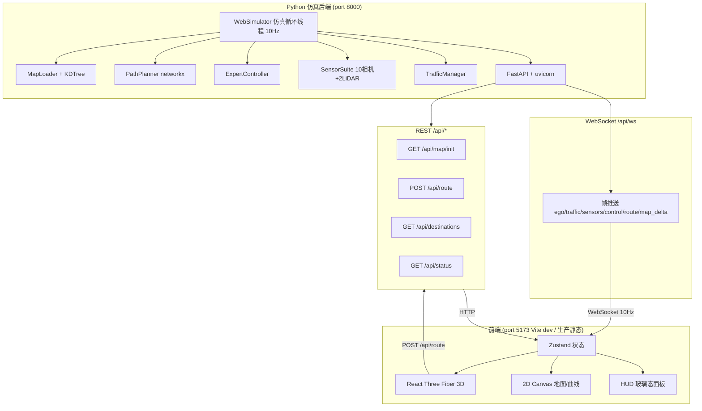
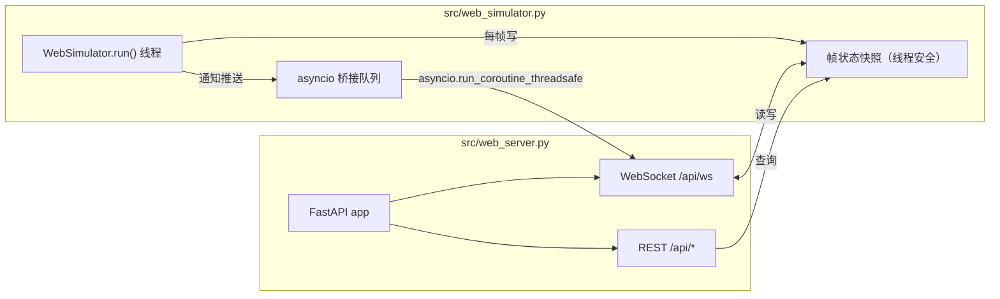
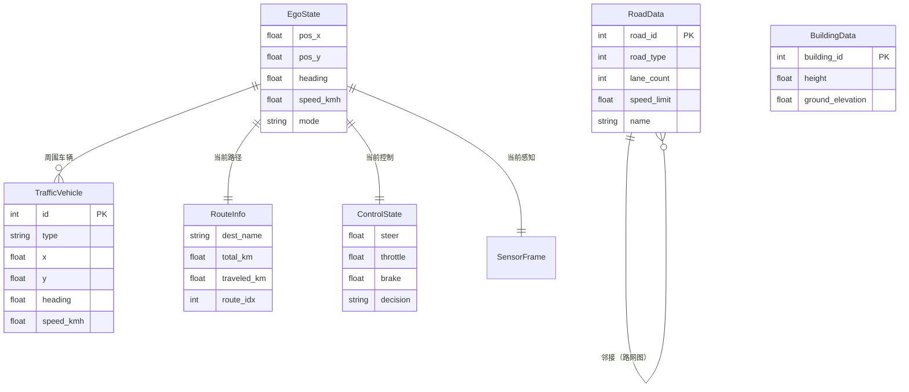

# AuroraDrive 极光智行 — 技术架构文档

> ⚠️ 本文档为 Python Sidecar 路线技术架构，已被 Route B 纯 C++ 迁移取代。实际架构见 REFACTOR_CHANGELOG.md 阶段7 Route B 说明。

> 配套 PRD：`.trae/documents/AuroraDrive-PRD.md`。本文档定义技术栈、前后端架构、路由、API 契约与数据模型。

---

## 1. 架构设计



**分层说明**：

- **仿真层（Python）**：复用现有 `MapLoader / PathPlanner / ExpertController / SensorSuite / TrafficManager`，封装为 `WebSimulator` 类跑在独立线程，10 Hz 步进。
- **桥接层（FastAPI）**：`src/web_server.py` 提供 WebSocket（实时帧推送）+ REST（一次性查询/地图分块/路径规划）。
- **前端层（React + R3F）**：Vite + TypeScript SPA，Zustand 管理 WebSocket 数据流，R3F 渲染 3D SR 场景，2D Canvas 渲染地图/曲线，玻璃态 HUD 浮层。

---

## 2. 技术栈

### 2.1 前端

- **框架**：React 18 + TypeScript 5
- **构建**：Vite 5（dev server port 5173，HMR）
- **样式**：Tailwind CSS 3 + CSS 变量（极光主题色板）
- **3D**：three 0.160 + @react-three/fiber 8 + @react-three/drei 9 + @react-three/postprocessing 2
- **状态**：Zustand 4（轻量，避免 Redux 样板）
- **动画**：Motion（framer-motion）— 数值过渡、页面切换
- **图标**：lucide-react
- **字体**：Google Fonts — Sora（display）/ IBM Plex Sans（body）/ JetBrains Mono（mono）
- **初始化工具**：`npm create vite@latest frontend -- --template react-ts`

### 2.2 后端

- **Web 框架**：FastAPI 0.110 + uvicorn 0.27
- **WebSocket**：FastAPI 原生 WebSocket（基于 starlette）
- **异步**：仿真循环跑 `threading.Thread`（阻塞计算），WS 推送走 `asyncio` 事件循环（通过 `asyncio.run_coroutine_threadsafe` 桥接）
- **二进制编码**：相机帧 JPEG（PIL 编码，quality 75）→ base64 字符串；LiDAR 点云 JSON 数组（点数限制 2048 × 2 路）
- **复用模块**：`src/map_loader.py` / `src/path_planner.py` / `src/expert_controller.py` / `src/sensors.py` / `src/traffic_manager.py` / `src/world.py` / `src/config.py`

### 2.3 目录结构

```
自动驾驶系统/
├── src/
│   ├── web_server.py          # 新增：FastAPI 应用 + WS 端点
│   ├── web_simulator.py       # 新增：仿真循环封装（线程化）
│   └── ...（现有模块复用）
├── frontend/                  # 新增：前端项目
│   ├── src/
│   │   ├── main.tsx
│   │   ├── App.tsx
│   │   ├── pages/
│   │   │   ├── CockpitPage.tsx       # 驾驶舱 SR 主视图
│   │   │   ├── NavigatorPage.tsx     # 导航台
│   │   │   └── DebugPage.tsx         # 感知调试
│   │   ├── components/
│   │   │   ├── three/                # R3F 3D 组件
│   │   │   │   ├── SRScene.tsx
│   │   │   │   ├── EgoVehicle.tsx
│   │   │   │   ├── TrafficVehicles.tsx
│   │   │   │   ├── RoadNetwork.tsx
│   │   │   │   ├── LaneHighlight.tsx
│   │   │   │   ├── RouteArrows.tsx
│   │   │   │   └── Buildings.tsx
│   │   │   ├── hud/                  # HUD 玻璃态面板
│   │   │   │   ├── SpeedHUD.tsx
│   │   │   │   ├── ModeSwitch.tsx
│   │   │   │   ├── DecisionPanel.tsx
│   │   │   │   └── BottomBar.tsx
│   │   │   ├── navigator/
│   │   │   └── debug/
│   │   ├── store/
│   │   │   └── useSimStore.ts        # Zustand 全局状态
│   │   ├── net/
│   │   │   ├── wsClient.ts           # WebSocket 客户端
│   │   │   └── apiClient.ts          # REST 客户端
│   │   ├── types/
│   │   │   └── ws.ts                 # 数据契约 TypeScript 类型
│   │   ├── theme/
│   │   │   └── aurora.css            # 极光主题 CSS 变量
│   │   └── utils/
│   ├── index.html
│   ├── tailwind.config.ts
│   └── package.json
├── run_web.py                 # 新增：启动入口（python run_web.py）
└── .trae/documents/
```

---

## 3. 路由定义

### 3.1 前端路由

| 路由 | 用途 |
|------|------|
| `/` | 驾驶舱（SR 主视图），默认页 |
| `/navigator` | 导航台（路径规划） |
| `/debug` | 感知调试（相机/LiDAR/控制曲线） |

实现：React Router 6，左下角胶囊导航切换；URL 同步支持深链接。

### 3.2 后端路由

| 路由 | 方法 | 用途 |
|------|------|------|
| `/api/ws` | WS | WebSocket 实时帧推送（10 Hz） |
| `/api/map/init` | GET | 初始地图块（按 ego 位置 + 半径） |
| `/api/map/delta` | GET | 增量地图块（视野变化时） |
| `/api/route` | POST | 路径规划 |
| `/api/destinations` | GET | 目的地模糊搜索 |
| `/api/status` | GET | 系统状态 |
| `/` | GET | 生产模式下托管 frontend/dist 静态资源 |

---

## 4. API 定义

### 4.1 WebSocket 消息契约

WebSocket 端点 `ws://localhost:8000/api/ws`。后端 10 Hz 推送消息，前端可发送控制消息（模式切换、目的地选择）。

**后端 → 前端消息**（TypeScript 类型）：

```typescript
// frontend/src/types/ws.ts

type WSMessage =
  | { type: 'ego_state'; data: EgoState }
  | { type: 'traffic'; data: TrafficVehicle[] }
  | { type: 'route'; data: RouteInfo | null }
  | { type: 'sensors'; data: SensorFrame }
  | { type: 'control'; data: ControlState }
  | { type: 'map_delta'; data: MapDelta }
  | { type: 'status'; data: SystemStatus };

interface EgoState {
  pos: [number, number, number];     // UTM x, y, z (m)
  heading: number;                   // rad
  speed_kmh: number;
  accel_ms2: number;
  steer_rad: number;
  mode: 'roam' | 'dest';
  step: number;
  timestamp: number;                 // ms epoch
}

interface TrafficVehicle {
  id: number;
  type: 'car' | 'suv' | 'truck' | 'bus' | 'motorcycle';
  x: number; y: number;
  heading: number;                   // rad
  speed_kmh: number;
  length: number; width: number; height: number;
}

interface RouteInfo {
  waypoints: [number, number][];     // UTM xy 序列
  dest_name: string;
  dest_xy: [number, number];
  total_km: number;
  traveled_km: number;
  eta_min: number;
  route_idx: number;                 // 当前路点指针
}

interface SensorFrame {
  cameras: string[10];               // JPEG base64（224×224）
  lidars: LidarFrame[2];             // 前/后
}

interface LidarFrame {
  source: 'front' | 'rear';
  points: [number, number, number][]; // xyz，最多 2048 点
}

interface ControlState {
  steer: number;        // -1 ~ 1
  throttle: number;     // 0 ~ 1
  brake: number;        // 0 ~ 1
  speed_kmh: number;
  decision: string;     // 'cruise' | 'follow' | 'brake' | 'lane_change_prep' | ...
  curvature: number;
  speed_limit: number;
  model_output?: { steer: number; throttle: number; brake: number };
}

interface MapDelta {
  added_roads: RoadData[];
  removed_road_ids: number[];
  added_buildings: BuildingData[];
  removed_building_ids: number[];
}

interface RoadData {
  road_id: number;
  road_type: number;                  // 0-5（高速/国道/省道/县道/乡道/村道）
  lane_count: number;
  speed_limit: number;                // km/h
  center_points: [number, number, number][];
  left_boundary: [number, number, number][];
  right_boundary: [number, number, number][];
  name: string;
}

interface BuildingData {
  building_id: number;
  vertices: [number, number][];       // xy
  height: number;
  ground_elevation: number;
}

interface SystemStatus {
  ws_connected: boolean;
  fps: number;
  sim_step: number;
  vehicle_count: number;
  cpp_backend: boolean;               // C++ autodrive_core 是否启用
  map_loaded: boolean;
}
```

**前端 → 后端消息**：

```typescript
type WSCommand =
  | { type: 'set_mode'; mode: 'roam' | 'dest' }
  | { type: 'set_destination'; dest_name: string; lon: number; lat: number }
  | { type: 'request_map_delta'; center: [number, number]; radius: number };
```

### 4.2 REST API

#### `GET /api/map/init?x=&y=&radius=`

返回 ego 周围指定半径内的道路与建筑（初始加载）。

```typescript
// Response 200
{
  roads: RoadData[];          // 见上
  buildings: BuildingData[];
  ego_origin: [number, number]; // UTM 基准点（前端做相对坐标）
}
```

#### `POST /api/route`

```typescript
// Request
{
  start_xy: [number, number];   // UTM
  end_xy: [number, number];
}
// Response 200
{
  waypoints: [number, number][];
  total_km: number;
  dest_name?: string;
}
// Response 404 (规划失败)
{ error: 'no_path'; detail: string }
```

#### `GET /api/destinations?q=`

```typescript
// Response 200
{
  results: { name: string; lon: number; lat: number; type: string }[];
}
```

#### `GET /api/status`

```typescript
// Response 200
{
  cpp_backend: boolean;
  map_loaded: boolean;
  road_count: number;
  vehicle_count: number;
  fps: number;
  sim_step: number;
}
```

---

## 5. 服务端架构

### 5.1 模块组成



### 5.2 关键设计

- **线程模型**：仿真循环是阻塞计算（传感器渲染、专家控制、交通更新），跑在 `threading.Thread`；FastAPI/uvicorn 跑 asyncio 事件循环。两者通过 `asyncio.run_coroutine_threadsafe(coro, loop)` 桥接，仿真线程每帧完成后把帧数据放入 `asyncio.Queue`，WS handler 从队列消费并推送。
- **帧快照**：`WebSimulator` 维护当前帧的线程安全快照（`threading.Lock` 保护），WS handler 与 REST 共享读，仿真线程独占写。
- **相机编码**：10 路 224×224×3 float32 → uint8 → JPEG（PIL，quality 75）→ base64。单帧约 10 × 8KB = 80KB。
- **LiDAR 截断**：每路最多推送 2048 点（已是 `LIDAR_MAX_POINTS`），xyz float → JSON 数字数组。
- **地图分块**：`/api/map/init` 返回 ego 周围 500m（`WORLD_LOAD_RADIUS`）内的道路与建筑；视野变化超阈值时前端发 `request_map_delta`，后端返回 `MapDelta`（added/removed）。
- **坐标系**：后端 UTM（EPSG:32650）；前端做相对坐标（减去 `ego_origin`）避免浮点精度问题；目的地搜索接口接受 lon/lat（EPSG:4326），后端用 pyproj 转换。

### 5.3 启动流程

```python
# run_web.py
from src.web_server import create_app
from src.web_simulator import WebSimulator

sim = WebSimulator(map_path='data/fujian_map.bin')
sim.start()                      # 启动仿真线程
app = create_app(sim)
import uvicorn
uvicorn.run(app, host='0.0.0.0', port=8000)
```

---

## 6. 数据模型

### 6.1 实体关系



### 6.2 后端数据来源映射

| 契约字段 | 后端来源 | 文件:行 |
|---------|---------|--------|
| `EgoState.pos` | `ego_pos` np.array[3] | run_demo.py:121 |
| `EgoState.heading` | `ego_heading` (rad) | run_demo.py:122 |
| `EgoState.speed_kmh` | `ego_speed` (km/h) | run_demo.py:123 |
| `EgoState.steer_rad` | `info['steer_rad']` | run_demo.py:330-334 |
| `TrafficVehicle[]` | `TrafficManager.vehicles` dict | traffic_manager.py:127 |
| `RouteInfo.waypoints` | `PathPlanner.plan()` 返回 | path_planner.py:4 |
| `SensorFrame.cameras` | `SensorSuite.render()` 10 路 | sensors.py |
| `SensorFrame.lidars` | `SensorSuite.render_lidar()` 2 路 | sensors.py |
| `ControlState.steer/throttle/brake` | `ExpertController.control()` 返回 | expert_controller.py |
| `RoadData.center_points` | `road_segment['center_points']` [N,3] | map_loader.py:125 |
| `RoadData.lane_count` | `road_segment['lane_count']` | map_loader.py:127 |
| `RoadData.left/right_boundary` | `road_segment['left_boundary'/'right_boundary']` | map_loader.py:125-126 |
| `BuildingData.vertices/height` | `building['vertices'/'height']` | map_loader.py:156-157 |

### 6.3 前端状态管理（Zustand）

```typescript
// frontend/src/store/useSimStore.ts
interface SimStore {
  // 连接
  wsConnected: boolean;
  // 最新帧
  ego: EgoState | null;
  traffic: TrafficVehicle[];
  route: RouteInfo | null;
  sensors: SensorFrame | null;
  control: ControlState | null;
  status: SystemStatus | null;
  // 地图（增量累积）
  roads: Map<number, RoadData>;
  buildings: Map<number, BuildingData>;
  egoOrigin: [number, number] | null;
  // 历史曲线（30s 滚动窗口）
  controlHistory: { t: number; steer: number; throttle: number; brake: number; speed: number }[];
  // Actions
  connect(): void;
  setMode(mode: 'roam' | 'dest'): void;
  setDestination(name: string, lon: number, lat: number): void;
}
```

---

## 7. 性能与可靠性

### 7.1 性能预算

| 指标 | 目标 | 措施 |
|------|------|------|
| WS 端到端延迟 | < 100 ms | 本地通信 + JSON 编码 |
| 单帧 WS 载荷 | < 300 KB | 相机 JPEG q75 + LiDAR 截断 2048 点 |
| 前端 3D FPS | 60 FPS（桌面） | 视野剔除 + InstancedMesh + 后处理适度 |
| 前端相机网格 FPS | 10 FPS（与仿真同步） | Canvas 2D 直接 drawImage |
| 仿真后端 FPS | 10 Hz | 复用 run_demo.py 的 DT=0.1 + FRAME_SKIP=5 |
| 地图初始加载 | < 2 s | 半径 500m 内道路/建筑，分块 |

### 7.2 可靠性

- **WS 断线重连**：前端指数退避重连（1s → 2s → 4s → 最大 10s），重连后请求 `/api/map/init` 重建地图状态
- **仿真线程崩溃**：`WebSimulator.run()` 包裹 try/except，异常写入 `status.error`，WS 推送错误帧，前端显示红色告警条
- **C++ 后端可选**：`CPP_AVAILABLE` 通过 `/api/status` 暴露；不可用时回退纯 Python（功能不变，性能降低）
- **资源清理**：uvicorn 关闭时 `sim.stop()` 优雅停止仿真线程

---

## 8. 实现顺序

1. **后端桥接**（Task #30）：`web_simulator.py` + `web_server.py` + `run_web.py`，先跑通 WS 推送 ego_state（最小可行）
2. **前端骨架**（Task #29）：Vite + React + TS + Tailwind + R3F 初始化，WS 客户端 + Zustand store + 三页路由
3. **驾驶舱 3D**（Task #31）：SR 场景 + ego + 道路 + 交通车 + 车道高亮 + 路径箭头 + HUD
4. **导航台**（Task #32）：2D 地图 + 搜索 + 路径预览 + 路点列表
5. **感知调试**（Task #33）：相机网格 + LiDAR 点云 + 控制曲线 + 系统状态
6. **改名扫尾**（Task #34，✅ 已完成 2026-07-13）：删除 `src/fsd_visualizer.py` + `run_demo.py` + `temp/infer_route.py`；`train_route.py` 剥离 pygame 可视化改为无头 BC 训练；全仓 `*.py` 零 FSD 命中。详见 `REFACTOR_CHANGELOG.md` 阶段 6。
