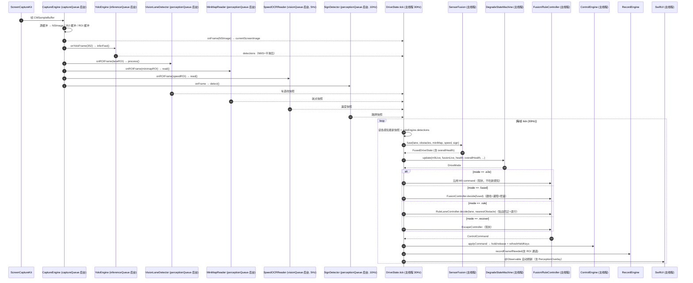

# AuroraDrive「OpenCV 驾驶感知重构」系统设计（v1）

| 项 | 内容 |
|---|---|
| 文档日期 | 2026-08-10 |
| 上游文档 | PRD-OpenCV驾驶重构-20260810.md（已定稿 v2） |
| 设计范围 | 新感知层（五信号）+ 融合层 + 档2/档3 控制器 + 梯子接线 + ROI 录制 + 调试可视化 |
| 铁律 | 档1 M9 与档4 脱困保持现状；禁止补丁式改动；控制统一键盘注入 |

---

## 1. 实现方案与框架选型

### 1.1 技术选型结论

| 能力 | 选型 | 说明 |
|---|---|---|
| 车道线/边缘/拟合 | **原生自写**（CoreImage + Accelerate/vImage，扫描线拟合替代 Hough） | 见 1.2 |
| BEV 鸟瞰变换 | CoreImage `CIPerspectiveTransform`（macOS 10.10+，系统自带） | 等价 OpenCV `warpPerspective`，无需第三方 |
| 速度 OCR | Vision `VNRecognizeTextRequest`（原生，Q4 已定） | 速度表 ROI 裁剪后识别数字 |
| HOG 路牌 | Vision 检测（P1，可插拔协议，先占位实现） | 见 1.4 |
| YOLO 避障 | **保留现有 YoloEngine** + 新增自车框过滤 | A8，不改推理链路 |
| 控制 | 复用 ControlEngine，映射不变 | B5 |

**结论：采用原生自写（PRD 方案 B）作为本期默认，通过协议抽象保留升级第三方 opencv2.framework（方案 A）的通道。**

理由：
1. 现状零第三方依赖、纯 SwiftPM 构建；opencv2.framework 无官方 SwiftPM 包（需 CocoaPods 或手打 xcframework，约 200MB+ 闭源二进制），引入成本高、与「纯外挂」定位冲突。
2. 目标画面（异环/NTE）画风固定：车道线白/黄、路面可控，颜色阈值 + Sobel 边缘 + 扫描线拟合即可达社区方案（jimhoggey 用 Canny+Hough）同等效果，且实现量小。
3. BEV 用系统自带透视变换，OCR 用 Vision，均无需 OpenCV。
4. 性能预算满足 ≥15fps 目标（见 1.3）。

### 1.2 原生车道线/BEV 关键算法步骤（VisionLaneDetector）

```
输入帧 CIImage（全屏或 laneROI）
1. 灰度:     CIColorControls(saturation=0)                    [GPU]
2. 降噪:     CIGaussianBlur(sigma=1.2)                        [GPU]
3. 边缘:     CISobelGradients → 幅度 → CIColorThreshold        [GPU]
   ※ macOS 14 无 CICannyEdgeDetector（15+ 才有），用 Sobel+阈值近似；
     用户若在 macOS 15+ 可直接替换 CICannyEdgeDetector，接口不变
4. 颜色掩膜: 白/黄车道线阈值（CIColorMatrix 转 YUV + CIColorThreshold）[GPU]
5. 融合:     边缘图 ∪ 颜色掩膜（颜色优先）                    [GPU]
6. 拟合:     BEV 透视变换（CIPerspectiveTransform，4 点标定）
             → BEV 空间按行扫描取车道像素 → 每侧最小二乘/斜率聚类
             拟合直线或二次曲线 → 反变换回图像坐标            [CPU 降采样 176 行]
7. 输出:     LaneLine{left,right} + centerOffset + curvature + confidence
```

- **不单独实现 Hough 投票**：CPU 霍夫投票在本分辨率收益低，扫描线+最小二乘拟合等价提取直线且更快更稳。
- **BEV（A7）**：标定 4 点（路面梯形 → 矩形），`CIPerspectiveTransform` 生成鸟瞰图，在 BEV 空间做平行线/路缘拟合 → 提升弯道、路缘鲁棒性。透视矩阵由 `PerceptionConfig.bevPoints` 配置（可调）。

### 1.3 性能预算（目标 ≥15fps，工作分辨率 640×360）

| 模块 | 预算 | 频控 |
|---|---|---|
| 灰度+模糊+阈值/Sobel（GPU） | ~1.5ms | 30Hz |
| BEV + 扫描线拟合（GPU+CPU） | ~2.5ms | 30Hz |
| 小地图 ROI（GPU+CPU） | ~1.5ms | 30Hz |
| 速度 OCR（Vision） | 3~10ms | **5Hz 降频** |
| HOG 路牌（Vision，P1） | 3~8ms | **10Hz 降频** |
| YOLO 直通（现有） | 5~15ms | 30Hz |
| **合计** | **~15~35ms** | 理论 25~60fps，保守 ≥15fps 达标 |

### 1.4 风险与对策

| 风险 | 对策 |
|---|---|
| 车道线拟合在强光/阴影/污损下降级 | 每模块输出置信度 → 融合层 overallHealth → 梯子降档（已设计 C3） |
| 颜色阈值对异环画风敏感 | 全部参数集中 `PerceptionConfig`（全局可调）+ E1 调试可视化实时调参 |
| TPV 下 YOLO 误框自车 → 异常刹车（已知坑） | `SelfCarFilter` 按自车 ROI 模板 IoU 过滤（P0）；UI 灰框显示被过滤框 |
| macOS 14 无 Canny 内核 | Sobel+阈值近似；macOS 15+ 可无缝换 CICannyEdgeDetector |
| 原生实现后期不满足鲁棒性 | `LaneDetecting` 协议抽象，可替换为 opencv2.framework 实现（方案 A 通道保留） |

---

## 2. 文件列表

### 新增（相对项目根 `/Users/dupi/Desktop/自动驾驶系统/`）

| 文件 | 职责 |
|---|---|
| `PerceptionModels.swift` | 感知统一数据模型（LaneLine/LaneDetection/MiniMapReading/SpeedReading/SignReading/FusedDriveState）+ 感知协议（LaneDetecting 等）+ PerceptionConfig |
| `VisionLaneDetector.swift` | 原生车道线检测 + BEV 变换（1.2 算法），实现 LaneDetecting |
| `MiniMapReader.swift` | 小地图蓝色导航线解析（ROI 裁剪 → 蓝色掩膜 → 方向向量/航点/turnHint） |
| `SpeedOCRReader.swift` | 速度表 OCR（Vision VNRecognizeTextRequest，5Hz 降频，失败降级策略） |
| `SignDetector.swift` | HOG/路牌检测（P1，Vision 检测，可插拔占位） |
| `SelfCarFilter.swift` | 自车框过滤（模板 ROI IoU + 尺寸/位置启发式） |
| `SensorFusion.swift` | 五信号融合 → FusedDriveState + 各置信度 + overallHealth |
| `SpeedPlanner.swift` | 控速规划（目标巡航 + 进弯按曲率/航点提前减速，参数化待标定） |
| `FusionController.swift` | 档2 融合驾驶控制器（跟线为主 + 避障叠加 + 控速） |
| `RuleLaneController.swift` | 档3 纯规则兜底（贴边回正 + 直行给油，基于车道线感知） |
| `PerceptionOverlay.swift` | 感知调试可视化叠加视图（车道线/小地图 ROI/OCR/档位/被过滤自车框） |
| `docs/class-diagram.mermaid` | 类图（独立文件） |
| `docs/sequence-diagram.mermaid` | 时序图（独立文件） |

### 修改

| 文件 | 改动 |
|---|---|
| `CaptureEngine.swift` | 新增 `onROIFrame` 回调：按 `PerceptionConfig` 裁剪小地图/速度表 ROI（GPU 缩放输出缓冲，复用现有双缓冲模式） |
| `DegradeStateMachine.swift` | 四档语义更新（.yolo → .fused 档2 融合驾驶）；输入从 assistLive 改为 fusionLive + overallHealth（感知置信度） |
| `AuroraDriveApp.swift` | DriveMode 枚举更新；DriveState 接线新引擎；tick() 决策管线改造；recordFrameIfNeeded 录制 ROI；新增 `--perception-selftest` 命令行 |
| `RecordEngine.swift` | 录制帧结构新增小地图/速度表 ROI 通道（D1） |
| `ContentView.swift` | GameViewportView 叠加 PerceptionOverlay；StatusPanel 档位/感知状态；ConfigPanel 新增 ROI/控速参数配置 |
| `Package.swift` | sources 注册全部新增文件 |

---

## 3. 数据结构与接口（类图）

```mermaid
classDiagram
    class CaptureEngine {
        +onFrame: ((NSImage)->Void)?
        +onYoloFrame: ((CVPixelBuffer)->Void)?
        +onROIFrame: ((ROIFrame)->Void)?
        +captureFPS: Double
        +start() void
        +stop() void
    }
    class ROIFrame {
        <<struct>>
        +kind: ROIKind
        +pixelBuffer: CVPixelBuffer
        +sourceRect: CGRect
    }
    class ROIKind {
        <<enum>>
        +minimap
        +speedometer
    }
    CaptureEngine --> ROIFrame : 产出
    CaptureEngine --> ROIKind

    class PerceptionConfig {
        +laneROI: CGRect
        +minimapROI: CGRect
        +speedROI: CGRect
        +bevPoints: [CGPoint]
        +selfCarROI: CGRect
        +targetCruiseSpeed: Double
        +cornerLookaheadSeconds: Double
        +minLaneConfidence: Double
    }

    class LaneDetecting {
        <<protocol>>
        +enabled: Bool
        +process(frame: CIImage) LaneDetection
    }
    class MiniMapReading {
        <<protocol>>
        +read(frame: CIImage, roi: CGRect) MiniMapReading
    }
    class SpeedOCRReading {
        <<protocol>>
        +read(frame: CIImage, roi: CGRect) SpeedReading
    }
    class SignDetecting {
        <<protocol>>
        +detect(frame: CIImage) [SignReading]
    }
    class SelfCarFiltering {
        <<protocol>>
        +filter(detections: [Detection]) FilteredObstacles
    }

    class LaneLine {
        +kind: Kind
        +points: [CGPoint]
        +curvature: Double
        +confidence: Double
    }
    class LaneDetection {
        +left: LaneLine?
        +right: LaneLine?
        +centerOffset: Double
        +headingAngle: Double
        +confidence: Double
    }
    class MiniMapReading {
        +direction: CGVector
        +waypoint: CGPoint?
        +turnHint: TurnHint
        +confidence: Double
    }
    class SpeedReading {
        +speedKmh: Double
        +confidence: Double
    }
    class SignReading {
        +kind: SignKind
        +box: CGRect
        +confidence: Double
    }
    class FilteredObstacles {
        +kept: [Detection]
        +filteredSelfCar: [Detection]
    }
    class Detection {
        <<existing>>
        +x: Double
        +y: Double
        +width: Double
        +height: Double
        +label: Label
        +confidence: Double
    }

    class FusedDriveState {
        +lane: LaneDetection?
        +obstacles: [Detection]
        +waypoint: MiniMapReading?
        +speed: SpeedReading?
        +sign: SignReading?
        +laneConfidence: Double
        +yoloConfidence: Double
        +miniMapConfidence: Double
        +speedConfidence: Double
        +overallHealth: Double
        +timestamp: Date
    }

    class SensorFusion {
        +fuse(lane: LaneDetection?, obstacles: FilteredObstacles, miniMap: MiniMapReading?, speed: SpeedReading?, sign: [SignReading]) FusedDriveState
    }
    class SpeedPlanner {
        +plan(fused: FusedDriveState) Double
    }
    class FusionController {
        +decide(fused: FusedDriveState) ControlCommand
    }
    class RuleLaneController {
        +decide(lane: LaneDetection?, nearestObstacle: Detection?) ControlCommand
    }
    class DegradeStateMachine {
        +update(m9Live: Bool, fusionLive: Bool, health: Double, warmingUp: Bool, speedKmh: Double, dt: Double, sportMode: Bool) DriveMode
    }
    class DriveState {
        +tick() void
        +startDriving() void
        +stopDriving() void
    }
    class ControlEngine {
        +hold(action: Action) void
        +release(action: Action) void
        +refreshHeldKeys() void
    }
    class ControlCommand {
        <<existing>>
        +steer: Double
        +throttle: Double
        +brake: Double
    }

    SensorFusion ..> FusedDriveState : 产出
    SensorFusion ..> Detection : 读
    SpeedPlanner ..> FusedDriveState : 读
    FusionController ..> SpeedPlanner : 用
    FusionController ..> FusedDriveState : 读
    FusionController ..> ControlCommand : 产出
    RuleLaneController ..> LaneDetection : 读
    RuleLaneController ..> ControlCommand : 产出
    DegradeStateMachine ..> FusedDriveState : overallHealth 输入
    DriveState --> SensorFusion : 组合
    DriveState --> FusionController : 组合
    DriveState --> RuleLaneController : 组合
    DriveState --> DegradeStateMachine : 组合
    DriveState --> ControlEngine : 组合
    VisionLaneDetector ..|> LaneDetecting : 实现
    MiniMapReader ..|> MiniMapReading : 实现
    SpeedOCRReader ..|> SpeedOCRReading : 实现
    SignDetector ..|> SignDetecting : 实现
    SelfCarFilter ..|> SelfCarFiltering : 实现
```



---

## 4. 程序调用流程（时序图）



**线程约定**：CaptureEngine 回调与 YOLO/感知推理全部在后台队列；tick()、融合、决策、按键注入、录制、UI 全在主线程。感知模块各自把「最新结果快照」（值类型结构体）写回主线程可见位置，用 `@Observable` + `@MainActor` 保证安全（与现有 YoloEngine.finish 模式一致）。

---

## 5. 任务列表（有序，按依赖）

| 任务 | 名称 | 源文件 | 依赖 | 优先级 | 验收要点 |
|---|---|---|---|---|---|
| T01 | 感知管道基础设施：数据模型 + 车道线/BEV 检测器 + 画面 ROI 输出 | 新增 `PerceptionModels.swift`、`VisionLaneDetector.swift`；修改 `CaptureEngine.swift`、`Package.swift` | — | P0 | 编译通过；`--perception-selftest <图>` 输出 LaneDetection（含 centerOffset/曲率/置信度）；CaptureEngine 按 ROI 裁剪输出小地图/速度表缓冲；车道线单帧 ≤6ms |
| T02 | 辅助感知模块：小地图 / 速度 OCR / 路牌 / 自车框过滤 | 新增 `MiniMapReader.swift`、`SpeedOCRReader.swift`、`SignDetector.swift`、`SelfCarFilter.swift` | T01 | P0 | 小地图输出方向/turnHint；OCR 输出数值车速且 5Hz 降频；路牌可插拔占位；自车框被正确过滤（kept/filteredSelfCar 分离）且 UI 可显示灰框 |
| T03 | 融合层 + 档2 融合驾驶控制（跟线+避障+控速） | 新增 `SensorFusion.swift`、`SpeedPlanner.swift`、`FusionController.swift` | T01, T02 | P0 | fuse 输出 FusedDriveState 五信号置信度 + overallHealth；档2 空路沿车道直行、弯道跟线转向、危险障碍避让叠加、进弯前按曲率/航点提前减速、维持目标巡航（默认 120） |
| T04 | 档3 纯规则兜底 + 梯子接线（四档重构 + ROI 录制） | 新增 `RuleLaneController.swift`；修改 `DegradeStateMachine.swift`、`AuroraDriveApp.swift`（DriveMode/tick/recordFrameIfNeeded）、`RecordEngine.swift` | T01, T03 | P0 | 档3 空路贴边回正+直行给油、不倒车不误刹；梯子按 overallHealth 单调降级/滞回恢复（.e2e↔.fused↔.rule↔.recover）；录制含 ROI 通道；档1/档4 行为与现状一致 |
| T05 | 感知调试可视化 + 全局参数配置 + 联调 | 新增 `PerceptionOverlay.swift`；修改 `ContentView.swift`（GameViewportView/StatusPanel/ConfigPanel）、`AuroraDriveApp.swift`（自检命令） | T01~T04 | P1 | 实时叠加车道线/小地图 ROI/OCR 结果/档位/被过滤自车框；ROI 与控速参数 UI 可调并即时生效；实测定档 2/3 ≥15fps 联调通过 |

---

## 6. 依赖包列表

**无新增第三方依赖**。全部基于系统框架：

```
- SwiftUI / AppKit / Observation      : 现有 UI 与状态（系统）
- CoreImage (CIColorControls/CIGaussianBlur/CISobelGradients/CIColorThreshold/CIPerspectiveTransform) : 车道线/BEV
- Vision (VNRecognizeTextRequest / VNDetectRectanglesRequest) : OCR / 路牌
- Accelerate / vImage                 : 可选的像素级加速（灰度/阈值优化用）
- CoreML (现有 YoloEngine)            : YOLO 避障（保持）
- ScreenCaptureKit (现有 CaptureEngine) : 捕获（保持）
```

> 升级通道（本期不做）：若原生车道线鲁棒性不达标，可引入 `opencv2.framework`（CocoaPods/xcframework），仅替换 `VisionLaneDetector` 内部实现，协议与融合层不变。

---

## 7. 共享知识（跨文件约定）

- **坐标归一化**：所有感知输出（车道线点、障碍框、ROI、航点）一律使用整帧归一化坐标 [0,1]，原点左上角；与现有 `Detection`、`aspectFillLayout` 一致。ROI 配置也存归一化 CGRect。
- **置信度范围**：所有置信度 ∈ [0,1]；模块无结果时输出 `confidence=0` + `isValid=false`，绝不返回 nil 空对象（值类型语义）。
- **线程模型**：后台队列只做纯计算并写「最新结果快照」；tick()/融合/决策/按键注入/录制/UI 全主线程；禁止在后台队列触碰 @Observable 可变状态（沿用 YoloEngine.finish 模式）。
- **帧率**：捕获 30Hz；感知主链路 30Hz；OCR 5Hz、路牌 10Hz 降频（读最新快照，不阻塞）。
- **控制映射不变**：W=13 / A=0 / S=1 / D=2 / 空格=49 / Shift=56；`applyCommand` 死区 ±0.1、throttle>0.3 才按 W、每帧 `refreshHeldKeys()`。
- **梯子语义**：档1 .e2e（M9，不吃新感知）→ 档2 .fused（车道线+YOLO 融合驾驶）→ 档3 .rule（纯规则兜底）→ 档4 .recover（脱困，现状）；降级单调 + 滞回 0.15。
- **控速参数**：`PerceptionConfig.targetCruiseSpeed` 默认 120（建议 100~140）；`cornerLookaheadSeconds` 默认 1.5（秒级起步待标定）；全局参数、不做按车配置文件（Q7）。
- **自车框过滤**：仅影响决策输入（kept），UI 用灰框显示 filteredSelfCar 以符合 E3。
- **调试日志**：沿用 `dlog` 写 stdout + `/tmp/aurora_debug.log`，1Hz 摘要加入感知置信度与档位。

---

## 8. 待明确事项（需用户/实测确认）

| # | 事项 | 现状假设 | 影响 |
|---|---|---|---|
| W1 | 异环小地图是否存在蓝色导航线、位置/遮挡 | 固定 ROI 裁剪起步（Q1 推荐默认） | 若无导航线，A2 降级为仅输出 turnHint=unknown，档2 控速退化为曲率驱动 |
| W2 | 速度表位置/字体 | 固定 speedROI（底部中央，Q4 默认） | OCR 准确率与 ROI 标定直接相关 |
| W3 | 车道线颜色（白/黄）、路面光照 | 颜色阈值 + Sobel 双通道融合 | 参数集中在 PerceptionConfig，E1 可视化实调 |
| W4 | 自车在 TPV 下的实际占屏位置/大小 | selfCarROI 模板（中心偏下大框） | 过滤阈值需实测，误杀真车则危险 |
| W5 | 弯道曲率 → 目标速度映射（lookahead/曲率阈值） | 默认 1.5s 提前量、线性映射 | 180km/h 场景实测标定 |
| W6 | macOS 系统版本 | 按 macOS 14（无 CICannyEdgeDetector，用 Sobel 近似）；15+ 可换 | 若用户系统为 15+，T01 可直接用 Canny |
| W7 | HOG 路牌优先级（P1） | Vision 检测先占位，语义仅 speedLimit/stop/unknown | 本期可只出框不出语义 |
| W8 | 验收路段/车型/车速组合 | 用户后补（Q10） | 联调验收范围 |
